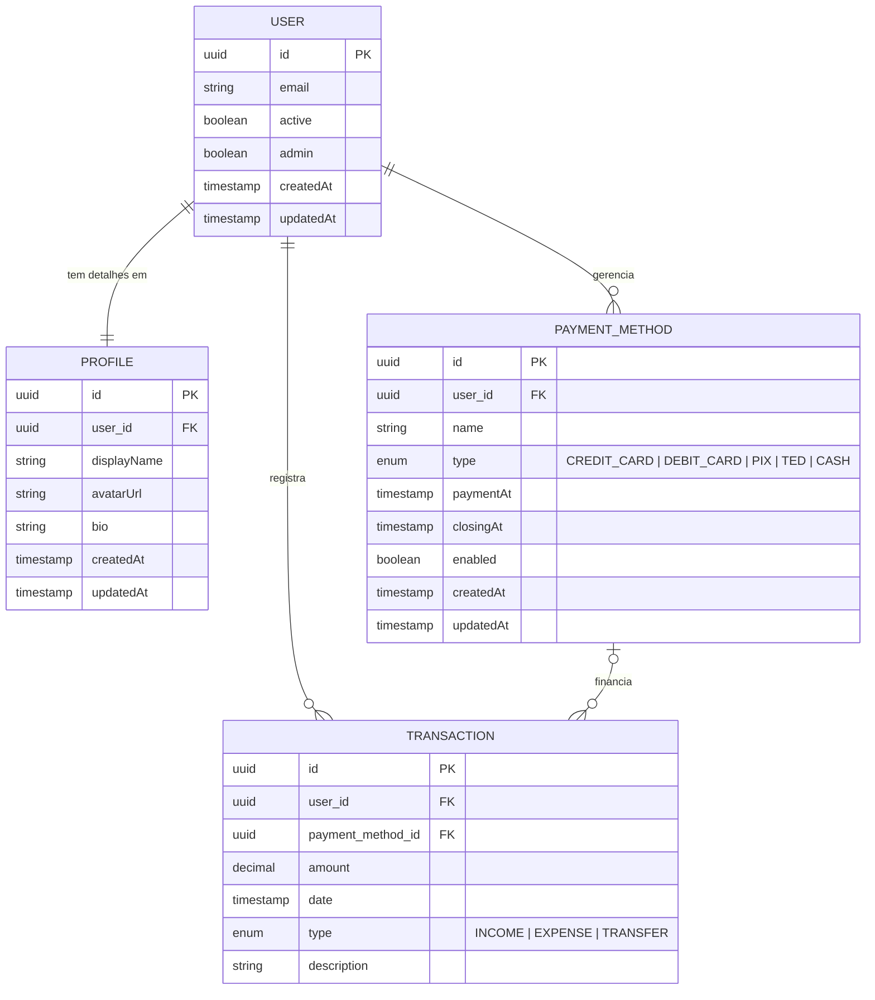

```mermaid
erDiagram
%% 1. Tabela de Usuários (Central)
USER {
uuid id PK
string email
boolean active
boolean admin
timestamp createdAt
timestamp updatedAt
}

    %% 2. Tabela de Perfil (1:1 com User)
    PROFILE {
        uuid id PK
        uuid user_id FK
        string displayName
        string avatarUrl
        string bio
        timestamp createdAt
        timestamp updatedAt
    }

    %% 3. Tabela de Métodos de Pagamento (1:N com User)
    PAYMENT_METHOD {
        uuid id PK
        uuid user_id FK
        string name
        enum type "CREDIT_CARD | DEBIT_CARD | PIX | TED | CASH"
        timestamp paymentAt
        timestamp closingAt
        boolean enabled
        timestamp createdAt
        timestamp updatedAt
    }

    %% 4. Tabela de Transações (1:N com User, N:1 com PaymentMethod)
    TRANSACTION {
        uuid id PK
        uuid user_id FK
        uuid payment_method_id FK
        decimal amount
        timestamp date
        enum type "INCOME | EXPENSE | TRANSFER"
        string description
    }

    %% --- RELACIONAMENTOS ---

    %% Um usuário tem exatamente UM perfil (One-to-One)
    USER ||--|| PROFILE : "tem detalhes em"

    %% Um usuário possui VÁRIOS métodos de pagamento (One-to-Many)
    USER ||--o{ PAYMENT_METHOD : "gerencia"

    %% Um usuário realiza VÁRIAS transações (One-to-Many)
    USER ||--o{ TRANSACTION : "registra"

    %% Um método de pagamento pode estar em VÁRIAS transações
    %% (Mas uma transação pode não ter método, ex: ajuste de saldo, por isso |o no lado da transação)
    PAYMENT_METHOD |o--o{ TRANSACTION : "financia"
```
